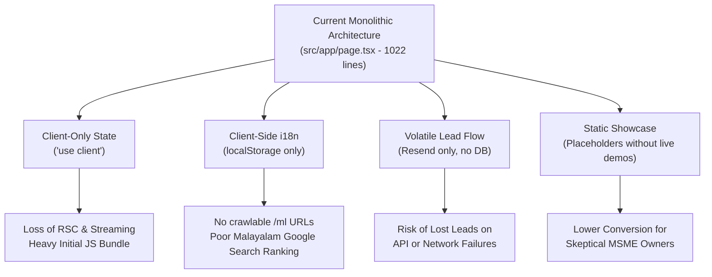

# Visible Kerala: Comprehensive Architectural Analysis & Strategic Roadmap

> **Document Type:** Project Audit & Engineering Roadmap  
> **Target Project:** Visible Kerala (`visiblekerala.com` / `visiblekerala.vercel.app`)  
> **Status:** Recorded for Future Implementation  
> **Date:** September 2026  

---

## 1. Executive Summary & Project Profile

**Visible Kerala** is a specialized web design, hosting, and local visibility agency built exclusively for small businesses and MSMEs across all 14 districts of Kerala (retail shops, clinics, bakeries, cafes, homestays, boutiques, tuition centers, hardware stores, etc.).

### 1.1 Core Business Model & Value Proposition
- **High-speed Delivery:** Turnaround in 2 to 5 days.
- **All-Inclusive Pricing:** Hosting, domain, Google Business Profile, and WhatsApp integration bundled with zero surprise fees.
- **Three Core Tiers:** Starter (₹3,999), Business (₹6,999), and Complete Presence (₹11,999).
- **Transparent Renewals:** Flat ₹1,499/year from Year 2 covering hosting, domain, and minor updates.
- **Risk Reversal:** "Pay after you see your website live and working."
- **WhatsApp-First:** Seamless click-to-chat onboarding and pre-filled inquiry triggers.

---

## 2. Technical Stack Audit

```
┌─────────────────────────────────────────────────────────────┐
│                      CURRENT TECH STACK                     │
├──────────────────────┬──────────────────────────────────────┤
│ Framework            │ Next.js 16.1.1 (App Router)          │
│ UI Runtime           │ React 19.0.0, TypeScript 5           │
│ Styling Engine       │ Tailwind CSS v4 (@tailwindcss/postcss)│
│ Bespoke Styling      │ 2.5D Claymorphic Design System       │
│ Database / ORM       │ Prisma 6.11.1 + SQLite (db.ts)       │
│ Lead Email Service   │ Resend API                           │
│ Component Primitives │ Radix UI / shadcn/ui (40+ in src/ui) │
│ Standalone Exporter  │ Custom script (scripts/gen-html.js)  │
└──────────────────────┴──────────────────────────────────────┘
```

### 2.1 File Structure Assessment
- **`src/app/page.tsx` (1,022 lines):** Contains the entire landing page markup, all state hooks, intersection observers, 3D tilt effects, language dictionary (`en` & `ml`), and form handler.
- **`src/app/globals.css` (1,719 lines):** Defines design tokens, spring physics (`cubic-bezier(0.34, 1.56, 0.64, 1)`), claymorphism elevation levels (`--clay-shadow-sm/md/lg`), and typography rules.
- **`src/app/layout.tsx` (41 lines):** Sets root HTML tags, Google Fonts preconnects, and baseline static OpenGraph metadata.
- **`src/app/api/contact/route.ts` (61 lines):** Direct HTTP POST handler receiving lead submissions and dispatching emails via Resend to `visiblekerala@gmail.com`.
- **`prisma/schema.prisma` (32 lines) & `src/lib/db.ts`:** Boilerplate Prisma setup pointing to SQLite with default `User` and `Post` models (currently unused).
- **`scripts/gen-html.js` & `download/visible-kerala.html` (2.51 MB):** Standalone zero-dependency offline bundle with base64-embedded assets.

---

## 3. Critical Technical Bottlenecks & Architectural Debt



### Issue 1: Monolithic Client Component
- **Symptom:** The entire homepage is marked `'use client'` in a single 1,022-line file.
- **Impact:** Server-side rendering (SSR) benefits and React Server Components (RSC) streaming are disabled for page sections. Any change in one section risks regressions in unrelated sections.

### Issue 2: Client-Side-Only Bilingual Implementation
- **Symptom:** English and Malayalam toggling is managed purely through React state (`useState<'en' | 'ml'>`) stored in `localStorage`.
- **Impact:** Search engine crawlers (Googlebot) only crawl the initial English render. There are no crawlable URLs for Malayalam content (e.g., `/ml`), sacrificing rank for Malayalam-language search queries like "വെബ്സൈറ്റ് ഡിസൈൻ കേരളം".

### Issue 3: Volatile Lead Handling (No Data Persistence)
- **Symptom:** In `src/app/api/contact/route.ts`, incoming contact inquiries are immediately sent via Resend without being recorded in the database.
- **Impact:** If Resend fails, experiences rate limits, or emails get marked as spam, high-intent client inquiries are permanently lost.

### Issue 4: Conceptual Rather Than Real-World Showcase
- **Symptom:** The portfolio section features 3 conceptual cards (*Malabar Delights*, *Royal Palm Homestay*, *Aura Bridal*) with text features rather than live interactive previews or subdomains.
- **Impact:** Traditional business owners in Kerala often require concrete visual proof of mobile responsiveness and WhatsApp ordering before committing.

### Issue 5: Missing Structured Data (Schema.org JSON-LD)
- **Symptom:** No rich snippets or structured schema are embedded in `layout.tsx` or `page.tsx`.
- **Impact:** Misses out on Google Search rich features like LocalBusiness cards, service packages, and FAQs.

---

## 4. Target Architecture & Refactoring Blueprint

```
┌────────────────────────────────────────────────────────────────────────┐
│                        TARGET MODULAR ARCHITECTURE                     │
└────────────────────────────────────────────────────────────────────────┘
                                    │
    ┌───────────────────────────────┴───────────────────────────────┐
    ▼                                                               ▼
[App Router & Routing]                                    [Core Business Modules]
src/                                                      src/
├── app/                                                  ├── components/
│   ├── [lang]/                                           │   ├── sections/
│   │   ├── layout.tsx                                    │   │   ├── HeroSection.tsx
│   │   ├── page.tsx (Server Component)                   │   │   ├── PackagesSection.tsx
│   │   ├── showcase/                                     │   │   ├── WorkflowSection.tsx
│   │   │   └── page.tsx                                  │   │   ├── ComparisonSection.tsx
│   │   ├── districts/[slug]/                             │   │   ├── ShowcaseSection.tsx
│   │   │   └── page.tsx (Programmatic SEO)               │   │   └── ContactSection.tsx
│   │   └── onboard/                                      │   ├── layout/
│   │       └── page.tsx (Client Intake)                  │   │   ├── Navbar.tsx
│   ├── api/                                              │   │   └── Footer.tsx
│   │   ├── contact/route.ts (DB + Resend)                │   └── common/
│   │   └── admin/leads/route.ts                          │       ├── TiltCard.tsx
│   ├── sitemap.ts                                        │       └── BeforeAfterSlider.tsx
│   └── robots.ts                                         ├── content/
                                                          │   ├── en.ts
                                                          │   └── ml.ts
                                                          └── lib/
                                                              ├── db.ts (Prisma Client)
                                                              └── seo.ts (JSON-LD schemas)
```

### 4.1 Database Schema Upgrade (`prisma/schema.prisma`)
Replace boilerplate models with real business models:

```prisma
model Lead {
  id           String      @id @default(cuid())
  name         String
  businessName String
  phone        String
  email        String?
  businessType String
  message      String?
  district     String?     // e.g. Ernakulam, Kozhikode, Wayanad
  status       LeadStatus  @default(NEW)
  notes        String?
  createdAt    DateTime    @default(now())
  updatedAt    DateTime    @updatedAt

  @@index([phone])
  @@index([status])
}

enum LeadStatus {
  NEW
  CONTACTED
  DEMO_SENT
  CLOSED_WON
  CLOSED_LOST
}

model ClientProject {
  id            String    @id @default(cuid())
  clientName    String
  businessName  String
  domain        String
  package       String    // Starter | Business | Complete Presence
  liveDate      DateTime?
  renewalDate   DateTime?
  renewalFee    Float     @default(1499.00)
  status        String    @default("ACTIVE")
  createdAt     DateTime  @default(now())
  updatedAt     DateTime  @updatedAt
}
```

---

## 5. Phased Implementation Roadmap

### Phase 1: Codebase Modularization & Clean Separation
- [ ] **1.1:** Move dictionaries from `page.tsx` into `src/content/en.ts` and `src/content/ml.ts`.
- [ ] **1.2:** Decompose `src/app/page.tsx` into modular section components in `src/components/sections/`:
  - `Navbar.tsx` & `Footer.tsx`
  - `HeroSection.tsx`
  - `PackagesSection.tsx`
  - `WorkflowSection.tsx`
  - `ComparisonSection.tsx` (Before & After interactive slider)
  - `ShowcaseSection.tsx`
  - `ContactSection.tsx`
- [ ] **1.3:** Convert top-level `page.tsx` into a lightweight container, keeping client interactivity scoped to individual widgets (`use client` only where required).

### Phase 2: Crawlable Bilingual Routing & Local SEO
- [ ] **2.1:** Implement route-based internationalization:
  - English default at `/` (or `/en`)
  - Malayalam localized at `/ml`
- [ ] **2.2:** Configure `sitemap.ts` with `hreflang` alternates linking English and Malayalam versions.
- [ ] **2.3:** Add Schema.org JSON-LD structured data:
  - `LocalBusiness` / `ProfessionalService`
  - `Product` / `OfferCatalog` for the ₹3,999 / ₹6,999 / ₹11,999 packages
  - `FAQPage` schema to answer common renewal and domain questions directly on Google.

### Phase 3: Resilient Lead Engine & Persistence
- [ ] **3.1:** Apply new `Lead` schema to SQLite (or configure Supabase/PostgreSQL for production).
- [ ] **3.2:** Refactor `src/app/api/contact/route.ts`:
  1. Validate incoming payload with Zod.
  2. Persist lead to database via `db.lead.create(...)`.
  3. Send notification email via Resend with graceful fallback (never fails user request if email glitches).
  4. (Optional) Trigger automated WhatsApp alert or webhook to the agency admin phone.
- [ ] **3.3:** Build a lightweight, password-protected `/admin/leads` dashboard or export script to track incoming inquiries.

### Phase 4: High-Conversion UX & Real-World Demos
- [ ] **4.1: Interactive Template Showcase:**
  - Build live interactive mini-previews or switchable device frames for top 4 niches:
    1. *Bakery / Cafe* (photo menu + WhatsApp order button)
    2. *Homestay / Resort* (gallery + booking inquiry)
    3. *Clinic / Healthcare* (consultation timings + appointment request)
    4. *Boutique / Tailoring* (collection lookbook + WhatsApp chat)
- [ ] **4.2: Interactive Package & ROI Calculator:**
  - Allow visitors to select their business type and desired features (e.g. number of pages, online booking, map embed) to get an instant cost estimate and direct WhatsApp summary.
- [ ] **4.3: Digital Client Onboarding Form (`/onboard`):**
  - A clean 3-step form for clients who have agreed to start, capturing logo upload, 5 store photos, contact details, and Google Maps pin.

### Phase 5: Programmatic District Landing Pages
- [ ] **5.1:** Create dynamic district pages (`/districts/[slug]`) targeting all 14 districts:
  - *Kochi / Ernakulam*, *Thiruvananthapuram*, *Kozhikode*, *Thrissur*, *Kottayam*, *Malappuram*, *Kannur*, *Palakkad*, *Alappuzha*, *Kollam*, *Kasaragod*, *Pathanamthitta*, *Idukki*, *Wayanad*.
- [ ] **5.2:** Tailor content per district (e.g., highlighting homestays in Wayanad/Idukki, retail & cafes in Kochi/Calicut).

---

## 6. Execution Readiness Checklist

When you are ready to implement any phase, execution can be initiated using these concise triggers:

| Command / Request | Action Taken |
| :--- | :--- |
| **"Execute Phase 1"** | Refactor `page.tsx` into modular section components and separate `en.ts`/`ml.ts` content files. |
| **"Execute Phase 2"** | Set up `/` and `/ml` localized routing, metadata tags, and JSON-LD schemas. |
| **"Execute Phase 3"** | Migrate Prisma schema with `Lead` model and update `api/contact` to persist leads. |
| **"Execute Phase 4"** | Build the interactive template showcase and package cost calculator. |
| **"Execute Phase 5"** | Set up programmatic district pages for all 14 Kerala districts. |
